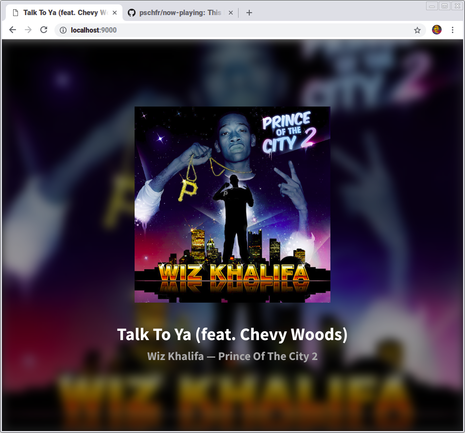

# Now Playing
This little website uses the Last.fm API to display what I'm currently (or most recently) listening to!

## Development
1. Clone / download this.
2. Install the [Harp.js web server](http://harpjs.com/).
3. Run `harp serve`.
4. Make any changes, and enjoy!

